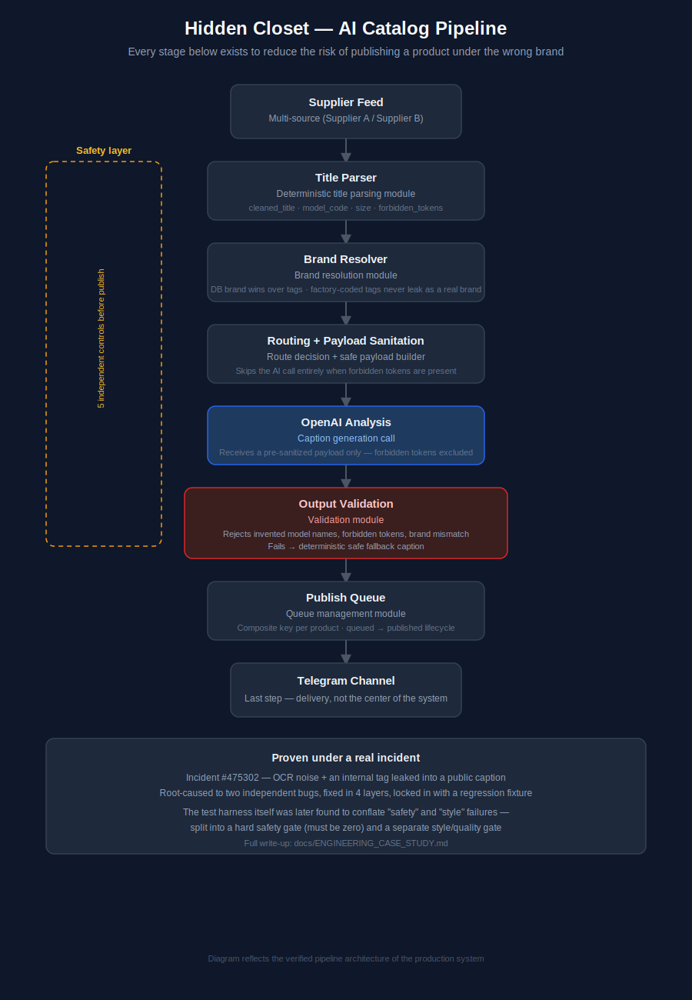
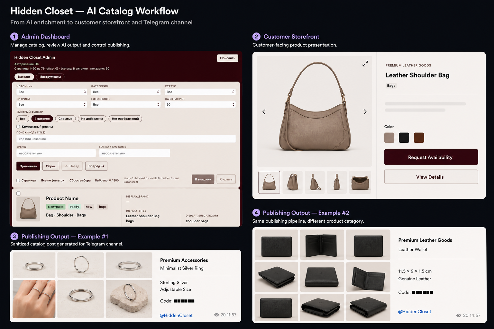

# Hidden Closet

**Production AI Catalog Processing Pipeline**

A backend system that takes raw supplier product feeds, generates safe AI-written captions, and publishes them to a live Telegram storefront — with multiple independent safety controls designed to prevent the one failure mode that actually matters: publishing a product under the wrong brand.

Full engineering write-up (architecture decisions, a real production incident, root cause, fix): **[docs/ENGINEERING_CASE_STUDY.md](./docs/ENGINEERING_CASE_STUDY.md)**

---

## Architecture



```
Supplier Feed → Title Parser → Brand Resolver → Routing → OpenAI
              → Output Validation → Publish Queue → Telegram
```

Telegram is the last step in the chain, not the center of it. Everything upstream exists to make sure nothing unsafe ever reaches it.

## Features

- Multi-source catalog ingestion with idempotent, branch-scoped sync — safe to re-import one source folder without touching the rest of the catalog
- AI caption generation behind multiple independent safety controls: (1) title parsing, (2) brand resolution, (3) pre-call payload sanitation + route gating, (4) output validation, (5) deterministic fallback before anything publishes
- Admin bot (catalog browse, search, publish/hide, AI re-analysis, publish queue) — Telegram as the interface
- Separate storefront API service for public-facing catalog access
- Read-only inspection tooling for debugging pipeline behavior against real data with no DB writes and no AI calls

## Tech stack

- **Backend:** Python, `aiogram` (async Telegram bot framework), `aiohttp`
- **AI:** OpenAI API, with a validation/fallback layer in front of it — not a raw pass-through
- **Automation:** Playwright (supplier catalog parsing)
- **Data:** SQLite (WAL mode), a dedicated schema for catalog sync state
- **Infra:** Linux VPS, systemd process supervision, Git-based deployment

## Screenshots



## Repository scope

This public repository contains an architecture overview, an engineering case study, and sanitized product screenshots. The production source code and operational configuration remain private, because the system processes live inventory for an active business.

## Engineering challenges

Three things worth reading the full case study for:

1. **A real production incident, root-caused and fixed across four layers**, not just patched once — with a permanent regression test added afterward.
2. **The test harness itself was wrong before it was right** — an early version conflated "unsafe" with "not polished yet," and fixing that meant redesigning the metric, not just the test cases.
3. **The system is intentionally still a monolith.** That trade-off, and why it was the right call at this stage, is explained rather than hidden.

→ [Read the full engineering case study](./docs/ENGINEERING_CASE_STUDY.md)
